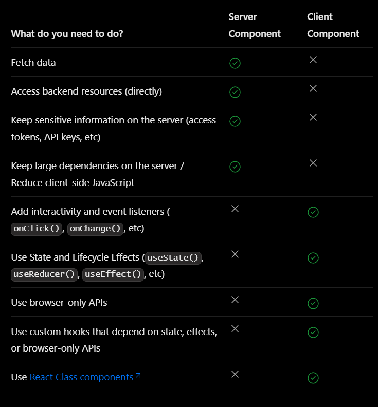

### NEXT 공식문서를 보며 개념을 익히기 위해 만든 미니게임 웹사이트입니다!

게임하러가기

1. 숫자야구
2. 땅따먹기
3. 다이아몬드게임
4. 끝말잇기
5. 반속체크
6. 두더지잡기
7. 사천성
8. 지뢰찾기

---

### 추가하고싶은 기능

1. 반응형
2. 타스 마이그레이션

### 프로젝트를 하며 학습한 NEXT의 개념을 기록합니다. 잘못된 부분이 있다면 PR 해주세요!

#### 1. Client-Side Navigation

> Next는 서버에서 렌더링 된 페이지를 받아오는 Server-Side-Rendering 프레임워크이다.
> 하지만 Next의 Link 컴포넌트는 Client-side Navigation 을 지원하게 만즐어준다.
> Link 컴포넌트가 브라우저의 ViewPort에 들어오는 순간 Next는 자동적으로 linked된 페이지를 Pre-Fetch한다.
> 이후 Link 컴포넌트 클릭 시 이미 로딩된 데이터들만 부분적으로 바꿔준다.
> 따라서 Next는 최초 1회에 한해서 서버에서 렌더링된 페이지를 받아오는 SSR로 동작하고, 이후에 브라우저에서 미리 로딩된 코드를 교체해주며, 자동으로 Code Splitting 해주어 빠르게 동작한다.

#### Next의 Hydration (https://helloinyong.tistory.com/315) (https://fourwingsy.medium.com/next-js-hydration-%EC%8A%A4%ED%83%80%EC%9D%BC-%EC%9D%B4%EC%8A%88-%ED%94%BC%ED%95%B4%EA%B0%80%EA%B8%B0-988ce0d939e7)

> Next는 클라이언트에게 웹 페이지를 보내기 전에 Server Side 단에서 미리 웹페이지를 Pre-Rendering 한다. 그리고 Pre-Rendering 으로 인해 생성된 HTML을 클라이언트에게 전송한다. 전달받은 HTML에는 JS 요소들이 하나도 없는데, 리액트가 번들링된 JS 요소를 즉각적으로 클라이언트에게 전송한다. 전달된 JS 코드는 이전에 전달된 HTML DOM 요소 위에서 한 번 더 렌더링 되면서 각자 자기 자리를 찾아가는데 이 과정을 Hydrate라고 한다.
> 이 과정에서 렌더링한 결과물이 어떤 컴포넌트인지 확인하고, 각 컴포넌트에 걸린 이벤트 리스너를 실제 DOM에 걸어주는데 이때 Next에서 내부적으로 사용하는 ReactDOM.hydrate함수는 서버에서 받아온 DOM 트리와 자체적으로 렌더링한 가상의 돔 tree를 비교하는데 이때 텍스트나 속성 값은 비교하지 않는다.

#### Next.js의 Pre-fetch, Pre-loading, Pre-rendering 차이점

> Pre-fetch : next/link나, next/router를 사용해 다른 페이지로 이동할 때 자동으로 해당 페이지의 코드를 미리 다운로드 하는 것. 사용자가 링크를 호버하거나 포커스하면 페이지의 자원을 미리 다운로드 한다. 즉, 페이지 전환 시 다음 페이지의 코드를 미리 다운로드 하는 것을 의미

> Pre-loading : 브라우저에게 특정 리소스를 미리 로드하도록 명시적으로 지시하는것 을 의미한다. link태그의 rel 속성값에 preload를 사용하면 리소스를 미리 받아올 수 있다.

> Pre-rendering : 사용자가 페이지를 요청하기 전에 서버 또는 빌드 시간에 미리 렌더링 하는것을 의미한다. 즉, 페이지를 미리 렌더링해 초기 로딩 속도를 향상 시키는 것을 의미. next는 기본적으로 모든 페이지를 pre-rendering한다.

#### Next.js의 Client Rendering과 Server Rendering

> Client Rendering :

## 삽질 기록

1. api cors에러 해결법 (next.config)
2. input에 스타일 주는법
3. 스크롤시 바닥으로 포커싱
